<h1>Membres Du Groupe:</h1> 
1- ELEKWA Michael(Responsable du groupe) 
2-HOUENOU Fabrice(Adjoint du responsable) 
3-HOUNNOUGBO Stephane 
4-KAKPO Mirabelle 
5-KOTY K.Igor Zaky 

<h1>Explorateur de Fichiers</h1>  

<h2>Description du projet</h2> 

Ce projet est un explorateur de fichiers développé en Python avec Tkinter. Il permet aux utilisateurs de naviguer dans leurs fichiers et dossiers, d'ouvrir des fichiers et de réaliser plusieurs opérations comme le marquage en favoris, la recherche et l'affichage des détails des fichiers. 

<h3>Fonctionnalités principales</h3>
Veuillez consulter le dossier "SCREENSHOTS" pour acceder aux screenshots associes a chaque numero

1-Navigation : Explorer les fichiers et dossiers en double-cliquant dessus.  
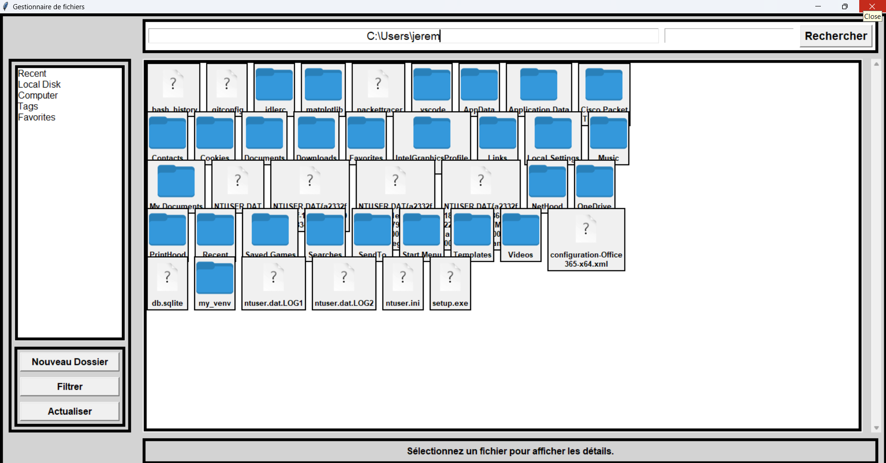 
2-Barre de chemin : Modifier manuellement le chemin pour accéder à un dossier. 
 
3-Affichage dynamique : Les fichiers et dossiers s'affichent avec leurs icônes respectives. 
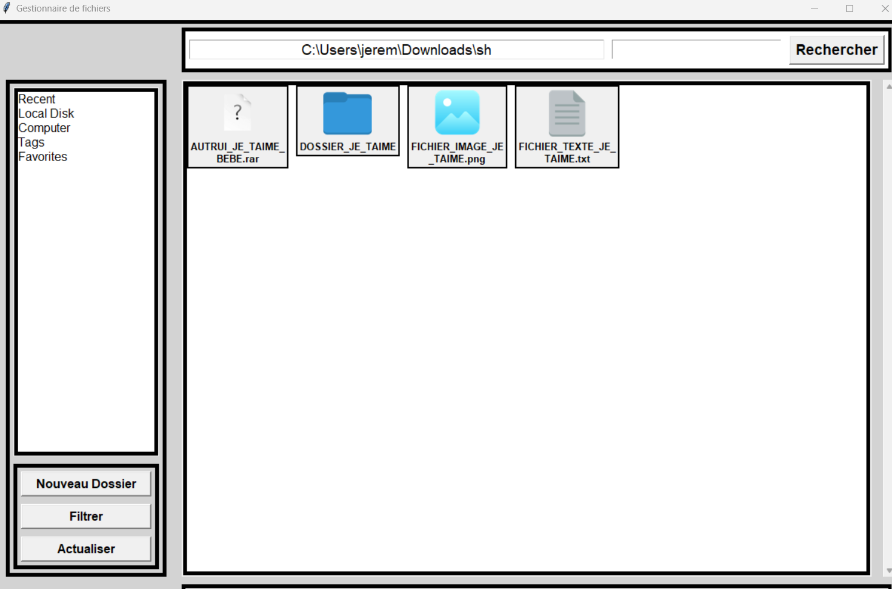 
DES ICONES ONT ETE DEFINIS POUR LES IMAGES, DOSSIERS, FICHIERS TXT ET PDF TOUT AUTRE ELEMENT SERA REPRESENTE AVEC L'ICONE AYANT LE POINT D'INTERROGATION  
4-Panneau latéral (LHS) : Affiche les catégories suivantes : 
  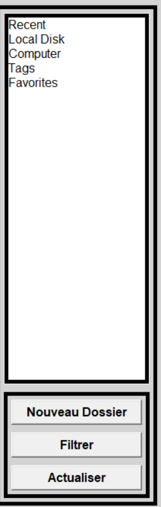 
  Local Disk : Accès au disque local. 
  Computer : Affiche tous les disques connectés. 
  Recent : Affiche les fichiers récemment ouverts. 
  Tags : Fonctionnalité non définie. 
  Nouveau dossier:creation de nouveau dossier 
  Actualiser: rafrachir 
  Filtrer: Afficher les elements en fontion d'un critere d'extension entree par l'utilisateur 
  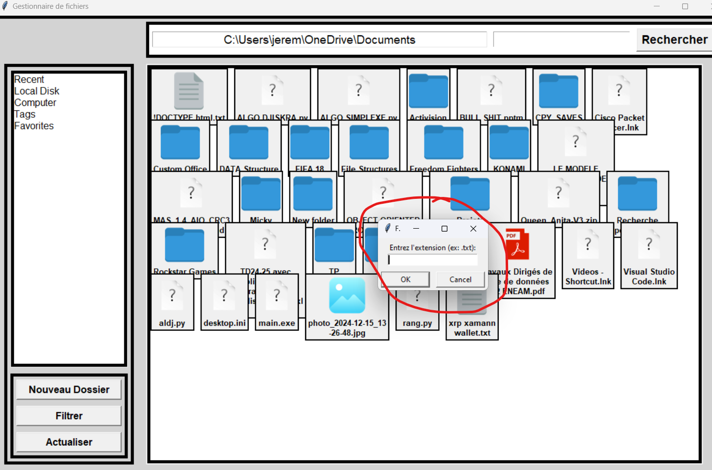 
5-Menu contextuel (clic droit) : Permet d’ouvrir, renommer et supprimer un fichier ou un dossier. 
 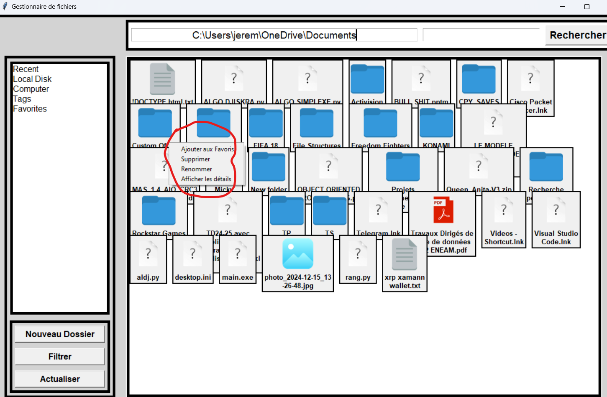 
6-Marquage en favoris : Ajout/suppression des fichiers et dossiers favoris. 
    1-L'OPTION D'AJOUTER AU FAVORI APPARAIT DANS LE MENU CONTEXTUEL 
     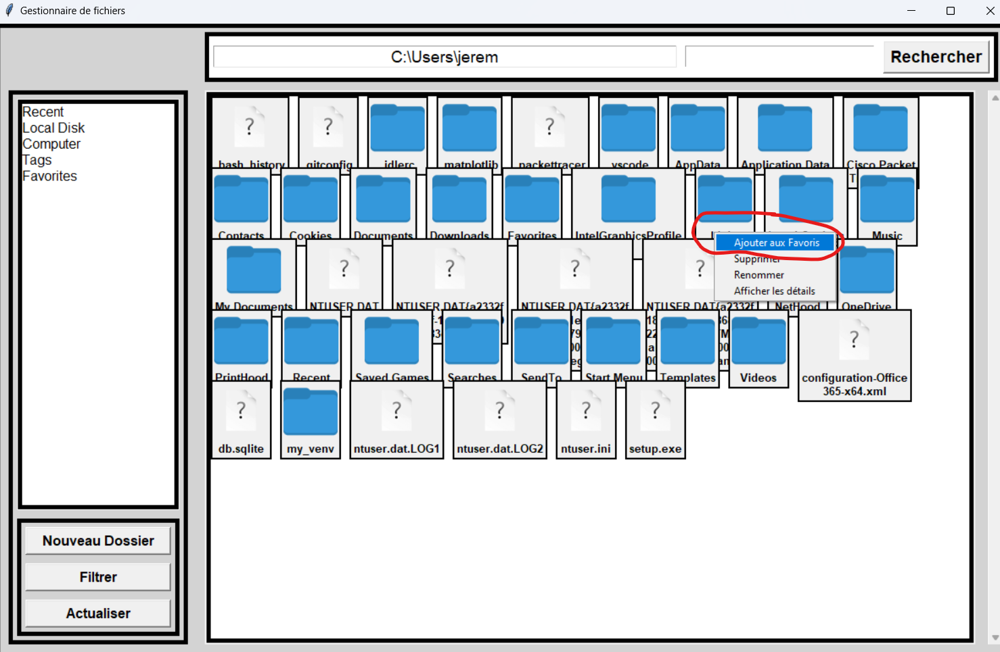 
    2-SI VOUS N'AJOUTEZ PAS D'ELEMENT A LA LISTE DES FAVORIS UN MESSAGE D'ERREUR S'AFFICHE 
    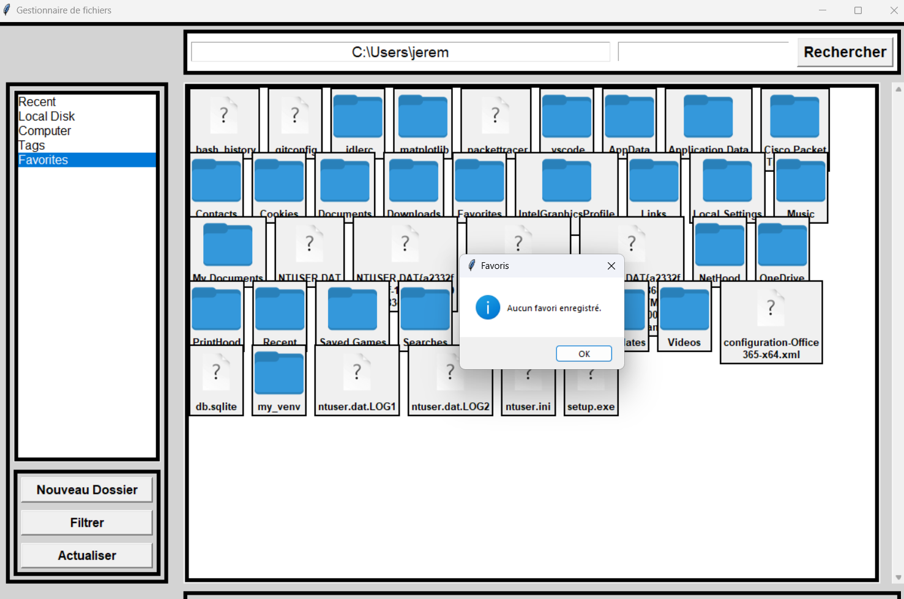 
    3-Une fois un element est ajoute au favori un message d'alerte s'affiche 
    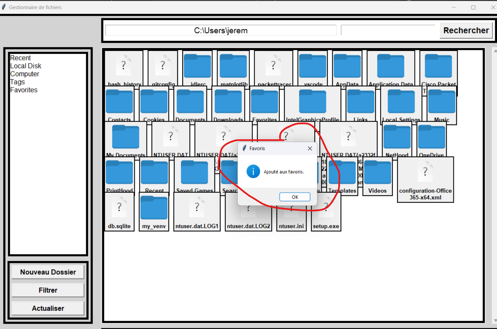 
7-Recherche : Trouver rapidement un fichier ou un dossier. 
 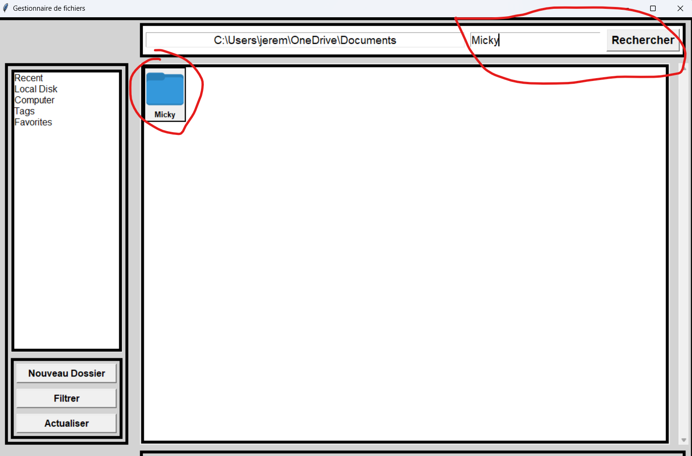 
8-Détails des fichiers : Affichage de la taille, date de création et autres métadonnées. 
     1-L'OPTION D'AFFICHER LES DETAILS APPARAIT DANS LE MENU CONTEXTUEL 
     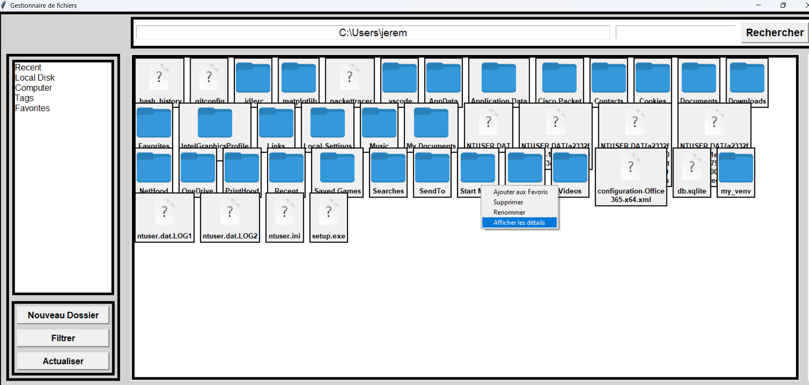 
     2-DETAILS DU FICHIER "FIFA 18" 
     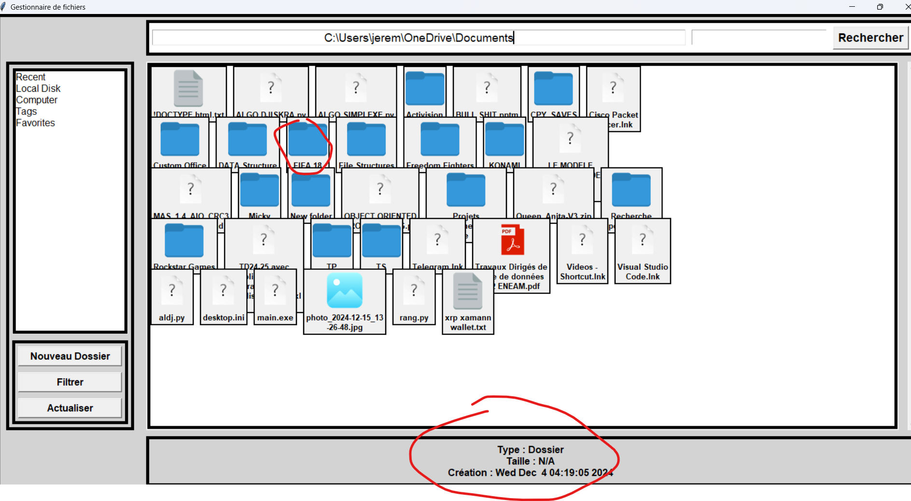 
9-Gestion des erreurs : Messages d’erreur en cas d’accès refusé ou de problème d’ouverture. 
     EXEMPLE: On n'a rien implemente pour l'option "TAG" du panneau laterale alors un message d'erreur s'afffiche 
     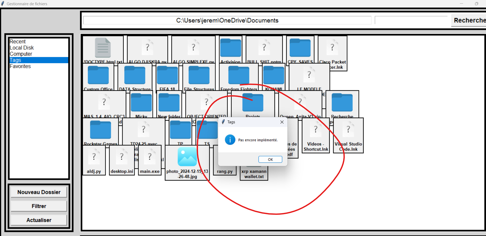 

Installation et utilisation 
Cloner le dépôt : 
 git clone  https://github.com/Michaeltheonlyone/Gestionnaire-de-Fichier.git 

 cd Gestionnaire-de-Fichier 

Installer les dépendances : 
 pip install pillow 

Lancer l’application : 
 python main.py 
